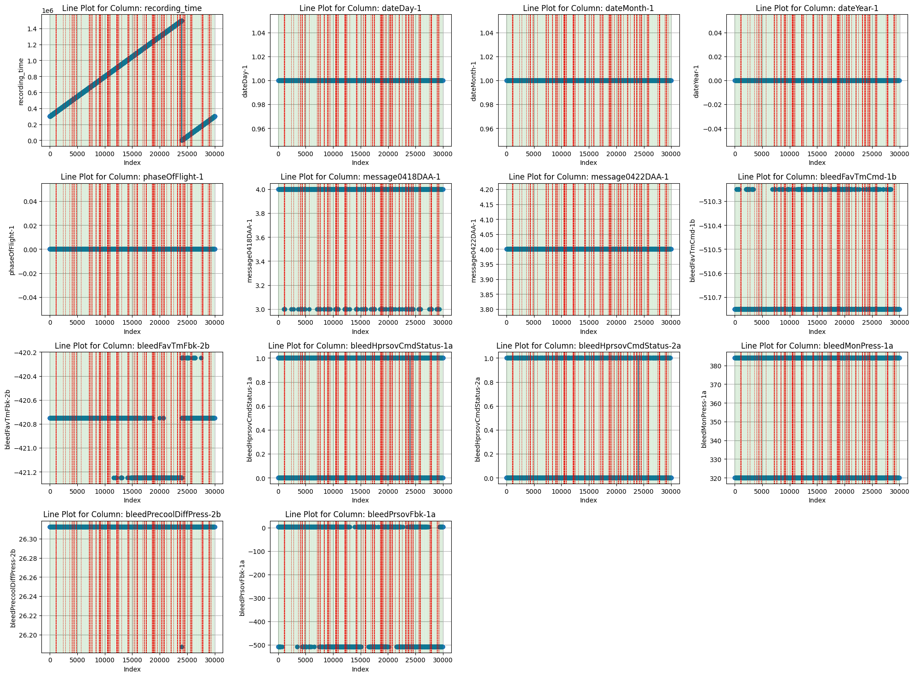

# Documentação Modelo Preditivo - Inteli

## Nome da Solução
### Artificial Air
#### Alysson Cordeiro, Henrique Schilder, Jean Rothstein, João Rodrigues, Luana Parra, Luiz Borges, Tainara Rodrigues

## Sumário
[1. Introdução](#c1)

[2. Entendimento do negócio](#c2)
 
[3. Engenharia de Requisitos](#c3)

[4. Economia Circular e Mapeamento do Ciclo de Produção e Consumo](#c4)

[5. Arquitetura dos dados](#c5)

[6. Modelo base](#c6)

[7. Modelo IA](#c7)

[8. Desenvolvimento da interface de usuário](#c8)

[Anexos](#attachments)

## 1. Introdução
O projeto do módulo 7 de Engenharia da Computação consiste na redução de consumo de combustível de aeronaves Embraer E2 através de Manutenção preditiva para a empresa parceira, Azul.

### 1.1 Empresa
A Azul Linhas Aéreas Brasileiras, fundada em 2008, é uma renomada companhia aérea de baixo custo no Brasil, destacada por sua extensa rede de voos nacionais e internacionais, serviços de qualidade e preços acessíveis. Operando uma frota moderna de aeronaves Embraer e Airbus, a empresa oferece aos passageiros refeições gratuitas em voos longos, entretenimento a bordo e assentos confortáveis. Além dos voos comerciais, a Azul também fornece serviços de carga, manutenção e reparo de aeronaves por meio de sua subsidiária, a Azul Viagens. Liderando com 158 destinos, maior número de decolagens diárias e uma malha flexível, a Azul se destaca como uma das principais companhias aéreas brasileiras.

### 1.2 Objetivos
1. Identificação Antecipada de Degradação: Nosso principal objetivo é desenvolver algoritmos de machine learning capazes de detectar sinais iniciais de degradação nos componentes do sistema BLEED. Ao analisar dados em tempo real provenientes das operações de voo, pretendemos criar modelos que possam prever possíveis falhas antes que elas ocorram, permitindo uma abordagem proativa na manutenção.
2. Otimização do Consumo de Combustível: Ao reduzir a degradação e falhas em componentes críticos, esperamos influenciar positivamente o consumo de combustível das aeronaves. Com o aumento da eficiência operacional resultante da manutenção preditiva, prevemos uma redução significativa nos custos associados ao consumo de combustível.
3. Garantia de Segurança Operacional: A identificação precoce de problemas nos componentes do sistema BLEED não apenas melhora a eficiência, mas também contribui para a segurança operacional das aeronaves. Detectar falhas potenciais antes que elas afetem o desempenho ou a segurança é essencial para manter os mais altos padrões de operação.
4. Utilização de Tecnologias Avançadas: O projeto envolverá a implementação de tecnologias avançadas, como machine learning, análise de dados em tempo real e automação de processos. Ao aproveitar essas tecnologias, buscamos maximizar a precisão das previsões e otimizar o fluxo de trabalho de manutenção.
5. Aproveitamento da AWS: Para alcançar nossos objetivos, faremos uso dos serviços da Amazon Web Services (AWS) para coleta, armazenamento, processamento e análise de dados, bem como para a implementação e treinamento de modelos de machine learning.

### 1.3 Proposta de solução
O sistema a ser desenvolvido consistirá de um modelo preditivo treinado de forma a prever falhas em componentes dos motores de uma aeronave, cujo uso e manutenção se dará por meio de sua disponibilização em uma aplicação web.

## 2. Entendimento do negócio
### 2.1 Personas 
Personas consistem em representações detalhadas e fictícias de distintos tipos de usuários ou clientes, os quais podem interagir com variados produtos, serviços, sites, aplicativos ou sistemas. São desenvolvidas a partir de dados concretos ou pesquisas relacionadas ao público-alvo, e desempenham um papel crucial como instrumentos para aprofundar a compreensão das demandas, aspirações, comportamentos, motivações e informações demográficas dos usuários.

No contexto do projeto de manutenção preditiva com uso de Inteligência Artificial, foram delineadas as personas Leandro Lucarini e Rebecca Ling. Estas personas foram construídas com base em informações obtidas por meio de entrevistas com líderes técnicos e profissionais de negócios na Azul, a fim de identificar os cargos e setores pertinentes ao projeto. Além disso, pesquisas detalhadas sobre o sistema e especificações técnicas foram empregadas para enriquecer a compreensão. A combinação desses dados permitiu a criação de retratos mais pormenorizados para cada persona, englobando aspectos como ocupação, interesses, metas, obstáculos encontrados na empresa e objetivos almejados.

A criação dessas personas proporciona insights valiosos. Por exemplo, ao considerar a implementação da IA de manutenção preditiva na Azul, torna-se evidente que poderá surgir a necessidade de introduzir funções e departamentos voltados para a gestão de dados e a manutenção do sistema. Essa iniciativa visará aprimorar as operações na companhia aérea, incumbência que pode ser atribuída à figura de Rebecca Ling. No caso de Leandro Lucarini, o produto pode desempenhar um papel essencial, ao prever antecipadamente as demandas de manutenção e facilitar o processo de tomada de decisões tanto em suas próprias tarefas quanto no âmbito de sua equipe.

Com essas personas delineadas, nossa equipe estará mais bem preparada para compreender de que maneira o produto influencia os diversos usuários e setores que poderão se beneficiar do nosso projeto. Isso nos permitirá personalizar o projeto de maneira mais eficaz e eficiente, a fim de atender às necessidades específicas de cada grupo de usuários.

### 2.2 Matriz Oceano Azul
A Matriz de Oceano Azul é uma análise de negócios estratégica que busca pelo melhor cenário de mercado onde uma empresa, produto ou serviço será inserido e que busca a irrelevância ou inexistência de concorrentes para a oportunidade de prosperidade do negócio. O conceito do Oceano Azul traz a ideia de um novo espaço dentro do mercado para o crescimento das empresas e negócios, diferentemente do Oceano Vermelho que apresenta um mercado saturado e bastante competitivo. 

Utilizamos a matriz Oceano Azul no projeto da IA preditiva de manutenção para que a equipe pudesse analisar o melhor cenário no mercado e pudesse desenvolver um produto que atendesse as necessidades do cliente da melhor maneira possível e que se destacasse de outros concorrentes.

Ao comparar o processo de manutenção feito atualmente pela Azul com a nova proposta de predição para a manutenção, é possível observar ganhos que trarão significativas diminuições de custos operacionais e que consequentemente trarão a redução de gastos com o combustível. 

Após uma análise cuidadosa do gráfico, identificamos os fatores que devem ser eliminados, reduzidos, aumentados e criados em nosso projeto. Além disso, notamos que nosso produto se encontra no mesmo quadrante que produtos já consolidados no mercado, o que nos leva a propor um projeto com similaridades. Essa abordagem nos permitirá construir sobre as melhores práticas existentes, ao mesmo tempo em que buscamos diferenciar-nos com melhorias e adaptações específicas para atender às expectativas e necessidades da empresa Azul.

**Eliminar**

- Necessidade de cálculos estatísticos manuais para prever necessidade de manutenção.

**Reduzir**

- Custos operacionais;
- Gastos com recursos.

**Elevar**

- Escalabilidade do serviço para outras áreas; 
- Eficiência e praticidade da manutenção.

**Criar**

- Previsão da manutenção com tecnologia;
- Banco de dados na nuvem para utilização de outros dados.

### 2.3 Canvas Proposta de Valor
O Canvas da Proposta de Valor é uma ferramenta que pode ajudar a criar e posicionar produtos ou serviço em torno do que o cliente realmente valoriza e precisa. É uma ferramenta que lhe ajuda a encontrar o encaixe produto-mercado de forma estruturada. Dessa maneira, ele é composto por 2 blocos: a Proposta de Valor e o Segmento de Clientes.

**Tarefas do Cliente (Customer Jobs):** Identificar a degradação dos componentes do sistema de bleed dos motores das aeronaves Embraer E2; Prever falhas nos componentes antes que elas ocorram; Minimizar o impacto nas operações das aeronaves.
Reduzir o consumo de combustível.

**Dores (Pains):** Maior consumo de combustível devido a falhas no sistema de Bleed dos motores; Restrições operacionais ao voar acima de determinada altitude (FL 310); Aumento da resistência do ar e consumo de combustível em altitudes mais baixas; Necessidade de empuxo maior e desempenho afetado em altitudes mais baixas; Risco de falhas não identificadas que podem levar a consequências adversas.

**Ganhos (Gains):** Economia de combustível significativa; Operações mais eficientes e menos restrições de altitude; 
Detecção antecipada de falhas e manutenção proativa; Melhoria do desempenho do motor e redução da necessidade de empuxo; 
Aumento da vida útil dos componentes e da aeronave como um todo.

**Produtos e Serviços (Products and Services):** Desenvolvimento de algoritmo de machine learning para detecção de degradação de componentes; Análise de dados de voo e criar um banco de dados; Filtragem de variáveis de entrada para prever falhas.

**Aliviadores de Dores (Pain Relievers):** Algoritmo de machine learning que detecta degradação de componentes de forma antecipada; Monitoramento constante dos dados de voo para detecção proativa de falhas; Possibilidade de manutenção preditiva, evitando falhas não planejadas.

**Criadores de Ganho (Gain Creators):** Economia substancial de combustível devido à manutenção preditiva e detecção antecipada de falhas; Otimização das operações das aeronaves, permitindo voos em altitudes mais eficientes; Maior confiabilidade da aeronave e melhoria da experiência do cliente; Potencial aumento da vida útil dos componentes e redução de custos de manutenção.

### 2.4 Matriz de riscos
Uma matriz de risco é uma ferramenta de gerenciamento de projetos que ajuda a identificar, avaliar e priorizar os riscos potenciais associados a um projeto. Ela é uma representação visual dos riscos organizados em uma tabela, geralmente com duas dimensões: impacto e probabilidade. Cada risco é avaliado com base em sua gravidade (alto, médio, baixo) e probabilidade de ocorrência (alta, média, baixa). A matriz de risco é importante porque fornece uma visão clara dos principais riscos que podem afetar o projeto, permitindo que a equipe tome medidas proativas para mitigar ou eliminar esses riscos, e se preparar para lidar com eles caso ocorram. Isso ajuda a minimizar surpresas, atrasos e falhas durante o desenvolvimento do projeto.

#### Mitigação das Ameaças:

1. Falha em adquirir dados de voo necessários para treinamento do modelo:

Mitigação: Garantir que os dados recebidos tenham ocorrências de falhas suficientes para o treinamento do modelo 

2. Risco de qualidade dos dados de voo:

Mitigação: Implementar processos de validação e limpeza de dados rigorosos, incluindo verificação manual e cruzamento de fontes para garantir a precisão dos dados.

3. Dificuldades na decodificação e formatação dos dados de voo:

Mitigação: Garantir o refinamento dos dados para alcançar o melhor desempenho do modelo 

4. Falha na identificação adequada de variáveis de entrada relevantes:

Mitigação: Realizar análises detalhadas das variáveis, garantir que as variáveis mais relevantes sejam incluídas.

5. Limitações de desempenho dos algoritmos de machine learning:

Mitigação: Realizar testes de desempenho em diversos algoritmos, otimizando hiperparâmetros e considerando técnicas de ensemble para obter resultados mais robustos e mais precisos.

6. Dificuldade em interpretar resultados e traduzi-los para ações operacionais:

Mitigação: Conseguir retirar respostas do modelo para construção de infográficos. 

7. Insuficiência de conhecimento técnico para implementar algoritmos de machine learning:

Mitigação: Garantir que o conhecimento em machine learning do time seja suficiente para  implementação correta do modelo preditivo.

8. Atrasos na entrega de resultados devido à complexidade dos modelos:

Mitigação: Estabelecer cronogramas realistas, priorizar simplificação inicial dos modelos e iterar gradualmente para aumentar a complexidade conforme o progresso.

### 2.5 Análise financeira
O desenvolvimento e a implementação de algoritmos de aprendizado de máquina têm se tornado cada vez mais essenciais em diversos setores, entre eles a aviação. No contexto das aeronaves Embraer E2, a detecção precoce de degradação em componentes críticos, como os presentes no sistema de bleed dos motores, desempenha um papel fundamental na garantia da segurança operacional, redução de custos de manutenção e otimização do desempenho das aeronaves. Nesse sentido, a análise financeira desse projeto é crucial para avaliar não apenas a viabilidade técnica, mas também o impacto econômico que a implementação de algoritmos de detecção de degradação pode trazer. O levantamento a seguir se diz respeito ao gasto mensal do investimento inicial necessário para a implementação, onde os principais gastos se dividem em: recursos humanos e serviços na AWS. 

A análise financeira do projeto envolve uma avaliação minuciosa dos elementos essenciais. No contexto do desenvolvimento, é fundamental considerar fatores como os salários mensais dos funcionários envolvidos, os custos da infraestrutura em nuvem, servidores e armazenamento. Os salários constituem um componente significativo, influenciando diretamente os gastos operacionais. Além disso, os custos associados à nuvem, servidores e armazenamento são pilares tecnológicos que requerem alocação precisa de recursos financeiros. A análise busca um equilíbrio entre os investimentos necessários e os potenciais retornos, visando garantir a viabilidade econômica do projeto no longo prazo.

## 3. Engenharia de Requisitos
Nessa etapa, a fase de engenharia de requisitos desempenha um papel de extrema importância no projeto, que tem como principal função, identificar falhas e a deterioração em elementos dos motores das aeronaves Embraer E2, trazendo uma base sólida de dados correlacionados para o desenvolvimento do algoritmo de aprendizado de máquina. Assim, será crucial analisar e documentar de maneira descritiva as especificações do sistema que está sendo arquitetado.Desse modo, é essencial priorizar os requisitos técnicos, funcionais, garantindo que o algoritmo seja capaz de interpretar e processar os dados, fornecendo uma boa acurácia sobre a degradação dos componentes e possíveis falhas. Além disso, a engenharia de requisitos também desempenha um papel vital na definição de métricas de desempenho, especialmente no progresso de desenvolvimento do projeto e critérios de sucesso para avaliar a eficácia do algoritmo, assegurando que ele atenda aos objetivos estratégicos do projeto e às necessidades da indústria de aviação em termos de segurança, eficiência operacional e redução de custos de manutenção.

### 3.1 Requisitos funcionais do sistema
1. Desenvolver um modelo preditivo para identificação precisa de falhas em motores de aeronaves, com capacidade de análise de múltiplos parâmetros para prever anomalias operacionais.
2. Filtrar, normalizar, agrupar e/ou dividir os dados como forma de pré-processamento, bem como outras manipulações necessárias na engenharia de características.
3. Alcançar acurácia de no mínimo 60% no modelo, através da otimização de algoritmos e de validação rigorosa, assegurando resultados confiáveis na detecção de falhas.
4. Criação de uma interface gráfica que apresente informações sobre tipo da aeronave, suas chances de falhas, bem como a possibilidade de detalhamento das métricas de predição de acurácia, bem como as do modelo sendo aplicado em sua geração.
5. Permitir a manipulação da base de dados utilizada para o treinamento do modelo por meio da interface gráfica.
6. Ter  a capacidade de realizar tanto o treinamento quanto a atualização subsequente do modelo de aprendizado de máquina, utilizando novos dados fornecidos sobre o sistema de bleed, permitindo uma constante adaptação às novas informações e garantindo que o modelo esteja sempre atualizado e refinado de acordo com a evolução dos dados e das condições operacionais.
7. Efetuar a identificação de situações potenciais de sobreajuste ou subajuste (overfitting e underfitting), por meio da análise contínua dos padrões de desempenho do modelo em relação aos dados de treinamento e validação, assegurando que o algoritmo construído esteja equilibrado e generalizado de forma otimizada para lidar com diferentes cenários e manter sua eficácia na detecção de falhas.

### 3.2 Requisitos não funcionais do sistema
1. Utilização da plataforma Amazon Web Services (AWS) para a hospedagem e processamento do modelo preditivo, garantindo escalabilidade e capacidade de lidar com grandes volumes de informações.
2. Facilitar a manutenção preventiva do sistema, com mecanismos que possibilitem atualizações regulares do modelo preditivo e das informações exibidas no dashboard, garantindo relevância contínua e evolução do sistema de detecção.
3. Ser escalável, ou seja, receber diferentes tipos de dados de mais de uma aeronave para possibilitar a comparação da influência de um determinado conjunto de parâmetros em diferentes aeronaves.
4. Implementação de mecanismos de segurança, garantindo a proteção dos dados sensíveis e o acesso restrito apenas a pessoal autorizado como por exemplo acesso por um e-mail específico da Azul e senha.
5. Performance de tempo de resposta rápida, assegurando que as análises e alertas sejam entregues em tempo hábil para tomada de decisões eficazes.
6. Ter uma arquitetura da solução modular, permitindo futuras expansões e integrações com outros sistemas e fontes de dados já existentes. Assim, o sistema tem que ser compatível com os outros sistemas que a companhia aérea já utiliza, por exemplo, ser executável no Sistema Operacional Microsoft Windows.
7. Estar disponível a maior parte do tempo, minimizando tempo de inatividade planejado ou não planejado.
8. O modelo de aprendizado de máquina, bem como a aplicação que o incorpora, devem possibilitar atualizações, correções de bugs e melhorias com facilidade.
9. Atualizações do modelo, correções de bugs e melhorias devem ser realizadas com facilidade.
10. A chamada para ação quanto a falha de determinado componente deve ser feita com o mínimo de antecedência.
11. A chamada para ação quanto a falha de determinado componente deve ser feita de forma inteligível a seu responsável pelo monitoramento, com possibilidade de detalhar as métricas da predição.

### 3.3 Estudo da viabilidade técnica realizada
O estudo da viabilidade técnica do desenvolvimento do atual sistema foi feito sob a ótica da avaliação da presença de dados para o treinamento de um modelo viável. Uma vez que sistemas de utilização de modelos preditivos hospedados em nuvem já são lugar comum na indústria, adota-se a premissa de que, uma vez desenvolvido o modelo, este poderá alimentar uma interface com recursos gráficos que permitam sua utilização e manipulação do conjunto de dados que o sustenta. 

A investigação da viabilidade técnica da construção de um modelo preditivo que atenda aos requisitos acordados em reuniões de alinhamento com a empresa parceira foi feita levando em conta os dados disponibilizados pela parceira de negócios Azul Linhas Aéreas Brasileiras S/A (Azul), bem como seu detalhamento, presente no Termo de Abertura de Projeto (TAP). No TAP, a Azul especifica que o escopo geral do projeto é “Desenvolver um algoritmo de machine learning [...] com capacidade de detectar a degradação de um dos componentes [...] que fazem parte do sistema de bleed dos motores das aeronaves Embraer E2 [...]”

Uma vez que é especificado o requisito de “detectar a degradação de um dos componentes”, fez-se necessário a exploração dos dados fornecidos em busca das informações necessárias para atingir tal objetivo. Como se trata de um modelo preditivo, foram buscadas informações de sensoriamento e do status dos componentes dos quais se objetiva fazer a predição de falha. Inicialmente, não foram encontradas informações que correspondessem à indicação de falhas nos componentes individuais, apenas de seus status de operação e de falhas gerais. Foi considerado que o status de operação de “inativo”, comumente presente nos dados fornecidos, não poderia ser utilizado como um proxy para a falha no componente, uma vez que sua inativação pode ter sido intencional. Portanto, para viabilizar o treinamento do modelo, será necessário avaliar os dados dos sensores quanto aos seus limites de operação fornecidos nos manuais dos motores pela Azul. Para cada série temporal contínua dos dados sensores, será criada uma série categórica que representa se sua medida está fora da faixa de operação que lhe corresponde. Com essa derivação dos dados, acredita-se que será possível alcançar o objetivo pretendido. 

Outro aspecto importante para o treinamento de um modelo preditivo que foi avaliado quanto a sua viabilidade dentro do contexto do projeto foi o número de exemplos de falhas gerais no sistema. A fim de fornecer o maior número de exemplos possíveis para o treinamento do modelo, a estratégia da agregação do conjunto de dados de múltiplos voos em um será estudada.

Dessa forma, a viabilidade técnica deste projeto foi avaliada com base em critérios sólidos, considerando tanto a robustez dos dados quanto a infraestrutura moderna disponível, o que solidifica a fundação para o desenvolvimento bem-sucedido do sistema e sua aplicação prática na detecção de falhas em componentes de aeronaves Embraer E2, e possivelmente a previsão de deterioração de alguns componentes específicos dado o acesso aos dados, como sobre a peça FAV, que correlaciona a altitude da aeronave com suas falhas. Portanto, com a adoção das estratégias descritas de engenharia de características para o treinamento do modelo e a robustez de ferramentas de disponibilização de modelos preditivos, julga-se o escopo do presente projeto como viável.

### 3.4 Diagrama de blocos 
A definição clara do objeto da proposta geral do sistema envolve a delimitação precisa dos elementos essenciais e metas que orientam o projeto de aprimoramento da manutenção preditiva das aeronaves da Azul. Nesse contexto, o objeto da proposta abrange a implementação de um sistema avançado de análise de dados e machine learning, focalizado na detecção proativa de degradação dos componentes do sistema BLEED das aeronaves. Por meio da coleta, processamento e análise inteligente de dados operacionais em tempo real, o sistema visa identificar antecipadamente indícios de falhas, proporcionando uma abordagem estratégica e preventiva para a manutenção, com a finalidade de otimizar a eficiência operacional, reduzir o consumo de combustível e assegurar a segurança das operações aéreas.

 

O diagrama do sistema apresenta de maneira visual a arquitetura e interconexões das principais componentes envolvidos na implementação do projeto de manutenção preditiva para as aeronaves da Azul. Assim, no diagrama, temos a interface do sistema, onde os usuários interagem com as informações e resultados gerados pela análise dos dados.

A partir da interface, os dados brutos das operações de voo são coletados e enviados para a nuvem, que desempenha um papel crucial na infraestrutura do sistema. A nuvem abrange tanto o servidor quanto o armazenamento de dados. O servidor na nuvem hospeda os serviços e aplicativos que processam e analisam os dados, incluindo a execução dos algoritmos de machine learning. O armazenamento na nuvem acomoda os dados brutos, bem como os dados processados e os modelos treinados.

A interação entre a interface e a nuvem é bidirecional. A partir da interface, os usuários podem fazer consultas, acessar informações e visualizar análises geradas na nuvem. Por outro lado, a nuvem fornece os resultados da análise de volta à interface, permitindo que os usuários tomem decisões informadas com base nas previsões de manutenção e otimização de consumo de combustível.

Esse diagrama reflete uma abordagem integrada, onde a interface proporciona a ponte entre os dados coletados das aeronaves e as análises avançadas realizadas na nuvem. A utilização da nuvem para processamento e armazenamento otimiza o desempenho e a escalabilidade do sistema, enquanto a interface garante uma experiência de usuário intuitiva e eficaz, maximizando o valor obtido a partir dos dados e análises gerados.

## 4. Economia Circular e Mapeamento do Ciclo de Produção e Consumo
### 4.1 Levantamento de requisitos
O levantamento de requisitos de visualização é uma etapa crucial no planejamento de um projeto de análise de dados e machine learning, onde o objetivo é desenvolver um conjunto de visualizações claras e eficazes para apresentar os resultados, insights e tendências derivados do modelo. Essas visualizações permitem que as equipes técnicas e não técnicas entendam de forma fácil e intuitiva as informações extraídas dos dados e tomem decisões informadas e embasadas.

#### Requisitos de Visualização: 
1. **Dashboard de Monitoramento:**
- Um painel interativo que exibe métricas-chave do projeto, como a taxa de sucesso na detecção de degradação, alertas gerados, tempo de resposta do modelo e status geral.
- Gráficos de linhas e barras para acompanhar as tendências ao longo do tempo.
  
2. **Mapa de Componentes Degradados:**
- Um mapa interativo que visualiza a localização geográfica das aeronaves onde componentes degradados foram detectados.
- Marcadores coloridos que indicam o nível de degradação, permitindo a identificação rápida das áreas problemáticas.
  
3. **Gráficos de Tendência:**
- Gráficos de série temporal que mostram a evolução da degradação de componentes ao longo do tempo.
- Permite identificar padrões sazonais e tendências significativas.

4. **Visualização de Correlações:**
- Matriz de correlação destacando as relações entre variáveis de entrada e a variável de saída (degradação).
- Identifica quais variáveis têm maior influência na detecção de degradação.

5. **Visualização de Casos de Uso:**
- Exemplos detalhados de aeronaves onde o modelo detectou com sucesso componentes degradados.
- Destaque para as variáveis de entrada que contribuíram para a detecção.

6. **Dashboard de Consumo de Combustível:**
- Visualização das economias de combustível após a detecção e resolução de degradações.
- Comparação antes e depois das ações corretivas.

7. **Heatmap de Componentes Degradados:**
- Heatmap que mostra quais componentes são mais propensos à degradação com base na frequência das detecções.
- Ajuda a identificar prioridades para ações de manutenção.

8. **Comparação de Modelos:**
- Visualização comparativa dos resultados de diferentes algoritmos de machine learning.
- Métricas de desempenho como acurácia, falsos positivos/negativos e curvas ROC.
- 
9.  **Visualização de Impacto:**
- Gráficos que mostram o impacto da detecção e resolução de degradações nos custos operacionais.
- Análise de ROI para demonstrar os benefícios do projeto.

O levantamento de requisitos de visualização assegura que as equipes envolvidas possam compreender facilmente as informações e tomar decisões embasadas e estratégicas para otimizar o consumo de combustível e a manutenção das aeronaves

### 4.2 Levantamento de processos socioambientais

Segundo a análise aprofundada que obteve-se acerca do ciclo produtivo das aeronaves Embraer E2, é evidente a nossa meticulosa dedicação à abordagem dos preceitos ESG (Ambiental, Social e Governança), e isso se entrelaça intrinsecamente à exploração dos potenciais característicos da economia circular em relação à otimização desse ciclo. A produção dessas aeronaves reflete a utilização de uma gama diversificação de materiais, tais como ligas de alumínio, titânio, como o *fan blade* da turbina, e compósitos afins. Portanto, é importante pontuar sobre os impactos inerentes à extração desses recursos naturais, bem como as emissões consequentes desse processo.

A fabricação dessas aeronaves engloba uma série de etapas multifacetadas, envolvendo desde a fase de produção até a etapa de montagem. Esses procedimentos acarretam no consumo de energia e podem facilitar na geração de emissões de gases de efeito estufa, por exemplo. Nesse contexto, assume uma relevância na avaliação representada sobre como viabilizar a otimização destas etapas, tornando-as mais eficazes e sustentáveis, como, por exemplo, questão da economia de combustível que foi mencionado como principal impasse da companhia aerea devido às frequentes falhas do sistema Bleed dos motores da aeronave, limitando-a a sobrevoar abaixo do seu limite esperado.

Além disso, também é relevante abordar as condições dos indivíduos envolvidos no ciclo de fabricação das aeronaves. Assegurar a preservação dos direitos trabalhistas e a garantia de um ambiente seguro e saudável garantindo como uma parte fundamental inerente à abordagem ESG. Ademais, não se pode esquecer da relevância que a governança corporativa detém, a qual engloba a transparência e a responsabilidade como elementos essenciais.

Vale ressaltar que uma reavaliação do ciclo produtivo coincide na concepção de um design sustentável, o qual habilite, por exemplo, uma desmontagem eficiente e a subsequente reciclagem das aeronaves, sem falar da reutilização de componentes provenientes de aeronaves desativadas e a concretização de processos destinados à reciclagem de materiais emergem como passos cruciais nesse contexto.

### 4.3 Infográfico

## 5. Arquitetura dos dados

### 5.1 Descrição dos dados coletados
Os dados fundamentais para o sistema de manutenção preditiva das aeronaves da Azul foram coletados meticulosamente, abrangendo uma frota diversificada composta por 17 aeronaves individuais. Em decorrência desse processo, cada voo executado por essas aeronaves desencadeia a geração de arquivos parquet únicos. Posteriormente, esses arquivos são transformados em dataframes (df), conferindo uma estrutura organizada que serve como alicerce fundamental para análises subsequentes. Em média, esses dataframes abrangem cerca de 80.000 linhas e 96 colunas, o que reflete uma extensão abrangente e aprofundada das informações contidas, além de permitir uma exploração detalhada do desempenho dos diversos componentes e sensores presentes nas aeronaves.

#### Dicionário dos dados
Siglas

- HP = (High Pressure)
- LP = (Low Pressure)
- AMSC = é um controlador que integrada às funções do sistema antidesgelo, ECS e APS a funções de controle do pneumatic-system.
- RH  = Right-Hand
- LH = Left-Hand

“**AMSC1** controls the *LH* side of the pneumatic system and **AMSC2**
controls the *RH* side of the pneumatic system.”

Partes importantes do pneumatic bleed-system:

- LPCV (Low Pressure Check Valve);
- HPSOV (High Pressure Shutoff Valve);
- PRSOV (Pressure-regulating Shutoff Valve);
- Engine bleed lines;
- PCE (Precooler);
- FAV (Fan Air Valve)
- BSPS (Bleed Switch Pressure Sensor)
- BMPS (Bleed Monitoring Pressure
Sensor)

Os numeros de min, max, e média foram calculados levando em conta uma amostra de 50 voos.

|Componentes                | Descrição                                                           | Taxa Hz | Enum                    |Tipo| Min | Max | Média |
|------------------------|-----------------------------------------------------------------------|---------|-------------------------|------|------|------|------|
| amscHprsovDrivF-1a     | Bleed Air System BAS LH High Pressure Shut-Off Valve HPSOV Driver Monitor [AMSC 1A] | 5 | 0=NOT FAILED; 1=FAILED   |   float32 |  0.0   |   0.0    |  0.0   |
| amscHprsovDrivF-1b     | Bleed Air System BAS LH High Pressure Shut-Off Valve HPSOV Driver Monitor [AMSC 1B] | 5 | 0=NOT FAILED; 1=FAILED   |   float32 |  0.0   |   0.0    |  0.0   |
| amscHprsovDrivF-2b     | Bleed Air System BAS RH High Pressure Shut-Off Valve HPSOV Driver Monitor [AMSC 2A] | 5 | 0=NOT FAILED; 1=FAILED   | float32 |  0.0   |   0.0    |  0.0   |
| amscPrsovDrivF-1a      | Bleed Air System BAS LH Pressure Regulating and Shut-Off Valve PRSOV Driver Monitor [AMSC 1A] | 5 | 0=NOT FAILED; 1=FAILED   | float32 |  0.0   |   0.0    |  0.0   |
| amscPrsovDrivF-1b      | Bleed Air System BAS LH Pressure Regulating and Shut-Off Valve PRSOV Driver Monitor [AMSC 1B] | 5 | 0=NOT FAILED; 1=FAILED   | float32 |  0.0   |   0.0    |  0.0   |
| amscPrsovDrivF-2b      | Bleed Air System BAS RH Pressure Regulating and Shut-Off Valve PRSOV Driver Monitor [AMSC 2A] | 5 | 0=NOT FAILED; 1=FAILED   | float32 |  0.0   |   0.0    |  0.0   |
| basBleedLowPressF-1a   | Bleed Air System BAS LH Low Pressure Monitor [AMSC 1A]                 | 5       | 0=NOT ACTIVE; 1=ACTIVE   | float32 |  0.0   |   0.0    |  0.0   |
| basBleedLowPressF-2b   | Bleed Air System BAS RH Low Pressure Monitor [AMSC 2B]                 | 5       | 0=NOT ACTIVE; 1=ACTIVE   | float32 |  0.0   |   0.0    |  0.0   |
| basBleedLowTempF-1a    | Bleed Air System BAS LH Low Temperature Monitor [AMSC 1A]             | 5       | 0=NOT ACTIVE; 1=ACTIVE   | float32 |  0.0   |   0.0    |  0.0   |
| basBleedLowTempF-2b    | Bleed Air System BAS RH Low Temperature Monitor [AMSC 2B]             | 5       | 0=NOT ACTIVE; 1=ACTIVE   | float32 |  0.0   |   0.0    |  0.0   |
| basBleedOverPressF-1a  | Bleed Air System BAS LH Over Pressure Monitor [AMSC 1A]              | 5       | 0=NOT ACTIVE; 1=ACTIVE   | float32 |  0.0   |   0.0    |  0.0   |
| basBleedOverPressF-2b  | Bleed Air System BAS RH Over Pressure Monitor [AMSC 2B]              | 5       | 0=NOT ACTIVE; 1=ACTIVE   | float32 |  0.0   |   0.0    |  0.0   |
| basBleedOverTempF-1a   | Bleed Air System BAS LH Over Temperature Monitor [AMSC 1A]           | 5       | 0=NOT ACTIVE; 1=ACTIVE   | float32 |  0.0   |   0.0    |  0.0   |
| basBleedOverTempF-2b   | Bleed Air System BAS RH Over Temperature Monitor [AMSC 2B]           | 5       | 0=NOT ACTIVE; 1=ACTIVE   | float32 |  0.0   |   0.0    |  0.0   |
| bleedFavTmCmd-1a       | Bleed Air System BAS LH Fan Air Valve FAV Command [mA] [AMSC 1A]    | 5       | PSIG            | float32 |  0.0   |   224.625    |  59.6062   |
| bleedFavTmCmd-1b       | Bleed Air System BAS LH Fan Air Valve FAV Command [mA] [AMSC 1B]    | 5       | PSIG                   | float32 |  0.0   |   179.125    |  32.6394   |
| bleedFavTmCmd-2a       | Bleed Air System BAS RH Fan Air Valve FAV Command [mA] [AMSC 2A]    | 5       | PSIG               | float32 |  0.0   |   175.625    |  55.9939   |
| bleedFavTmCmd-2b       | Bleed Air System (BAS) RH Fan Air Valve (FAV) Command [mA] [AMSC 2A]| 5       | PSIG                   | float32 |  0.0   |   175.625    |  55.9917   |
| bleedFavTmFbk-1a       | Bleed Air System (BAS) LH Fan Air Valve (FAV) Command Feedback [mA] [AMSC 1A] | 5 |       PSIG                  | float32 |  0.0   |   230.5    |  61.5751   |
| bleedFavTmFbk-1b       | Bleed Air System (BAS) LH Fan Air Valve (FAV) Command Feedback [mA] [AMSC 1B] | 5 |          PSIG               | float32 |  0.25   |   180.75    |  34.0059   |
| bleedFavTmFbk-2b       | Bleed Air System (BAS) RH Fan Air Valve (FAV) Command Feedback [mA] [AMSC 2A] | 5 |          PSIG               | float32 |  0.0   |   178.875    |  58.0665   |
| bleedHprsovCmdStatus-1a| Bleed Air System (BAS) LH High Pressure Shut-off Valve (HPSOV) Command Status [AMSC 1A] | 10 | 0=CLOSED; 1=OPEN | float32 |  0.0   |   1.0    |  0.2454   |
| bleedHprsovCmdStatus-1b   | Bleed Air System BAS LH High Pressure Shut-off Valve HPSOV Command Status [AMSC 1B] | 10 | 0=CLOSED; 1=OPEN       | float32 |  0.0   |   1.0    |  0.1397   |
| bleedHprsovCmdStatus-2a   | Bleed Air System BAS RH High Pressure Shut-off Valve HPSOV Command Status [AMSC 2A] | 10 | 0=CLOSED; 1=OPEN       | float32 |  0.0   |   1.0    |  0.2437   |
| bleedHprsovCmdStatus-2b   | Bleed Air System BAS LH High Pressure Shut-off Valve HPSOV Open Position Status [AMSC 1A] | 10 | 0=CLOSED; 1=OPEN       | float32 |  0.0   |   1.0    |  0.2437   |
| bleedHprsovOpPosStatus-1a | Bleed Air System (BAS) RH High Pressure Shut-off Valve (HPSOV) Command Status [AMSC 2A] | 10 | 0=NOT OPEN; 1=OPEN     | float32 |  0.0   |   1.0    |  0.3861   |
| bleedHprsovOpPosStatus-1b | Bleed Air System BAS LH High Pressure Shut-off Valve HPSOV Open Position Status [AMSC 1B] | 10 | 0=NOT OPEN; 1=OPEN     | float32 |  0.0   |   1.0    |  0.3861   |
| bleedHprsovOpPosStatus-2a | Bleed Air System BAS RH High Pressure Shut-off Valve HPSOV Open Position Status [AMSC 2A] | 10 | 0=NOT OPEN; 1=OPEN     | float32 |  0.0   |   1.0    |  0.3849   |
| bleedHprsovOpPosStatus-2b | Bleed Air System BAS RH High Pressure Shut-off Valve HPSOV Open Position Status [AMSC 2B] | 10 | 0=NOT OPEN; 1=OPEN     | float32 |  0.0   |   1.0    |  0.3849  |
| bleedMonPress-1a          | Bleed Air System BAS LH Monitoring Pressure BMPS [psig] [AMSC 1A]   | 5       |                         | float32 |  0.375   |   180.0    |  64.8163   |
| bleedMonPress-1b          | Bleed Air System BAS LH Monitoring Pressure BMPS [psig] [AMSC 1B]   | 5       |                         | float32 |  0.375   |   180.0    |  64.8240   |
| bleedMonPress-2a          | Bleed Air System BAS RH Monitoring Pressure BMPS [psig] [AMSC 2A]   | 5       |                         | float32 |  0.625   |   180.0    |  67.8478   |
| bleedMonPress-2b          | Bleed Air System (BAS) RH Monitoring Pressure (BMPS) [psig] [AMSC 2A]| 5       |                         | float32 |  0.625   |   180.0    |  67.8479   |
| bleedOnStatus-1a          | Bleed Air System BAS LH Pressure Regulating and Shut-off Valve PRSOV Activation [AMSC 1A] | 10 | 0=BLEED OFF; 1=BLEED ON | float32 |  0.0   |   1.0    |  0.8558   |
| bleedOnStatus-1b          | Bleed Air System BAS LH Pressure Regulating and Shut-off Valve PRSOV Activation [AMSC 1B] | 10 | 0=BLEED OFF; 1=BLEED ON | float32 |  0.0   |   1.0    |  0.8558   |
| bleedOnStatus-2b          | Bleed Air System BAS RH Pressure Regulating and Shut-off Valve PRSOV Activation [AMSC 2A] | 5 | 0=BLEED OFF; 1=BLEED ON | float32 |  0.0   |   1.0    | 0.8711   |
| bleedOverpressCas-2a      | CAS Message BLEED 2 OVERPRESS                                        | 5       | 0=NOT SET; 1=SET        | float32 |  0.0   |   0.0    |  0.0   | bleedOverpressCas-2b      | CAS Message BLEED 2 OVERPRESS                                        | 5       | 0=NOT SET; 1=SET        | float32 |  0.0   |   0.0    |  0.0   
| bleedPrecoolDiffPress-1a  | Bleed Air System BAS LH Precooler Differential Pressure DPS [psid] [AMSC 1A] | 5 || float32 |  -0.25   |   4.75    |  0.5655 
|bleedPrecoolDiffPress-1b  | Bleed Air System BAS LH Precooler Differential Pressure DPS [psid] [AMSC 1B] | 5 || float32 |  -0.25   |   4.75    |  0.5674   
|bleedPrecoolDiffPress-2a  | Bleed Air System BAS RH Precooler Differential Pressure DPS [psid] [AMSC 2A] | 5 || float32 |  -0.1875  |   4.75    |  0.53994    
| bleedPrecoolDiffPress-2b  | Bleed Air System (BAS) RH Precooler Differential Pressure (DPS) [psid] [AMSC 2A]| 5 || float32 |  -0.1875   |   4.75    |  0.5399   
| bleedPrsovClPosStatus-1a  | Bleed Air System BAS LH Pressure Regulating and Shut-Off Valve PRSOV Closed Position Status [AMSC 1A] | 10 | 0=NOT CLOSED; 1=CLOSED | float32 |  0.0   |   1.0    |  0.14414   
| bleedPrsovClPosStatus-2a  | Bleed Air System (BAS) RH Pressure Regulating and Shut-Off Valve (PRSOV) Closed Position Status [AMSC 2A] | 10 | 0=NOT CLOSED; 1=CLOSED | float32 |  0.0   |   1.0    |  0.1288   |
bleedPrsovFbk-1a |...| | |float32 | 0.0 | 366.125 | 107.0771 | 

**a) Enumeração dos Dados Disponibilizados**

Os dados coletados abrangem informações importantes sobre o desempenho operacional das aeronaves. A seleção criteriosa resultou em um conjunto de 45 features específicas, a fim de maximizar a relevância à análise proposta. Complementando essa estrutura, encontramos dados "y" destinados à análise, que demarcam eventos indicativos de falhas e são denominações específicas, indentificados por nomes como "Message0418DAA1" e "Message0422DAA1".

**b) Fontes que Geraram os Dados**

A origem dos dados deriva das operações de voo das distintas aeronaves incorporadas à frota da Azul. A captura em tempo real das variações de desempenho dos componentes e sensores se traduz na criação de arquivos parquet individuais, que armazenam as características de cada voo.

**c) Tipos dos Dados**

Os atributos que preenchem as colunas ostentam predominantemente valores numéricos, destacando-se o tipo float64. A singularidade da coluna "recording_time", cujo tipo é int64, acrescenta diversidade à estrutura. Ademais, há valores categóricos representados por enumerações (0=NOT FAILED; 1=FAILED, 0=CLOSED; 1=OPEN, etc.). As colunas também incluem informações relacionadas a pressão, temperatura, ativação de válvulas, feedback de comandos, entre outros, além de que os dados "y" relativos a eventos de falhas são associados a valores específicos, servindo como marcos indicativos de falhas no sistema BLEED..

**d) Faixa de Valores dos Dados**

A amplitude dos valores capturados nas colunas variam entre -1 e 3. É relevante mencionar que essa amplitude é passível de variação, a depender da natureza intrínseca de cada coluna. Curiosamente, o valor 0 emerge como o mais frequente, encapsulando situações onde a ausência de informações nulas (NaN) prevalece.

**e) Periodicidade de Coleta dos Dados**

A dinâmica de coleta de dados se desenrola em intervalos de 50 milissegundos (ms), sincronizados com os voos das aeronaves. A cada 50 ms, é feita uma "foto" registrando o desempenho dos componentes e sensores, tais "fotos" são salvas em arquivos parquet individuais.

Resumindo, a análise se concentra em entender as 45 features escolhidas pela Azul para encontrar padrões e entender como tudo está interligado. Assim, a captação dos dados "y", vinculados a eventos de falhas, assume uma dimensão estratégica, fornecendo percepções vitais que sustentam aprimoramentos nas estratégias de manutenção preditiva. Este aspecto, por sua vez, reverbera no reforço da segurança e na operação confiável das aeronaves da Azul.

### 5.2 Descrição do armanezamento dos dados
Os dados coletados estão armazenados em um repositório no Google Drive. Cada voo gera um arquivo parquet individual que contém informações detalhadas sobre o desempenho dos componentes e sensores durante a operação da aeronave. Os dados são organizados em pastas, cada uma representando um voo específico.

Na Sprint 3 do projeto, optamos por armazenar os dados em um banco de dados PostgreSQL. Utilizando a estrutura do FastAPI, estamos desenvolvendo uma solução robusta e flexível para interagir com esse banco de dados, o que nos permite criar APIs de forma ágil e segura, facilitando o processo de inserção, recuperação e atualização de informações. Isso não apenas simplifica o gerenciamento dos dados coletados, mas também abre possibilidades para a construção de serviços e aplicativos que podem acessar esses dados de maneira eficiente e escalável.

Nossa estratégia consiste em desenvolver todo o sistema de tratamento e pré-processamento dos dados, além de estabeleceremos um pipeline de dados bem estruturado, delineando as etapas necessárias para implementar e treinar nosso modelo de análise. Para isso, optamos por empregar os serviços da AWS, que proporcionam um ambiente ideal para o armazenamento, gestão e organização eficiente das informações coletadas. Isso nos permitirá otimizar a exploração desses dados, conduzindo a resultados mais confiáveis e a insights valiosos para aprimorar nossas operações.

#### AWS (Amazon Web Services)
A arquitetura projetada se aproveitará das capacidades escaláveis, flexíveis e seguras da AWS para transformar dados brutos em insights valiosos e modelos de machine learning eficazes. Abaixo estão as principais áreas em que a AWS provavelmente será empregada:

**1. Coleta e Armazenamento de Dados:**

Amazon S3: Os dados brutos coletados das operações de voo serão armazenados no Amazon S3. Esse serviço de armazenamento escalável e altamente durável garantirá a retenção segura dos dados, permitindo o acesso rápido quando necessário.

**2. Preparação e Transformação de Dados:**

Amazon Glue: Para preparar e transformar os dados, usaremos o Amazon Glue. Ele oferece recursos de ETL (Extração, Transformação e Carga) para processar grandes volumes de dados, permitindo a limpeza, transformação e integração dos dados brutos em um formato adequado para análise.

**3. Processamento e Análise de Dados:**

Amazon EMR: Para realizar análises de ciência de dados em larga escala, empregaremos o Amazon EMR. Ele permite o processamento distribuído e paralelo de dados usando estruturas como Hadoop e Spark. Isso é crucial para realizar operações complexas de limpeza, normalização, seleção de features e redução de dimensionalidade.

**4. Treinamento de Modelos de Machine Learning:**

Amazon SageMaker: O Amazon SageMaker será utilizado para implementar, treinar e avaliar modelos de machine learning. Ele oferece um ambiente completo para desenvolvimento, treinamento e implantação de modelos, permitindo iterações rápidas e a seleção do modelo mais adequado.

**5. Implantação de Modelos:**

Amazon SageMaker Endpoint: Após o treinamento, os modelos serão implantados em endpoints usando o Amazon SageMaker Endpoint. Isso permitirá que os modelos sejam acessados através de APIs, possibilitando a integração com aplicações em tempo real.

**6. Escalabilidade e Flexibilidade:**

A AWS oferece escalabilidade automática, permitindo que os recursos se expandam ou contraiam de acordo com a demanda. Isso é essencial para lidar com grandes volumes de dados e operações intensivas de processamento.

**7. Segurança e Conformidade:**

A AWS implementa medidas robustas de segurança e oferece ferramentas para gerenciar a conformidade com regulamentações. Isso garante a proteção dos dados e a conformidade com as políticas internas e regulamentações externas.

### 5.3 Descrição do pré-processamento dos dados
Para assegurar a viabilidade da solução, é imperativo lidar com os valores NaN oriundos dos sensores. Para essa finalidade, adotaremos a moda para dados categóricos e a última instância para dados quantitativos. Após essa etapa, efetuaremos a conversão dos dados qualitativos, como "amscHprsovDrivF-1b" e "amscHprsovDrivF-1a", em dados quantitativos, seguida pela normalização de todos os dados provenientes dos sensores, visando estabelecer um intervalo comum de 0 a 1.

**a) Tratando valores NaN oriundos dos sensores:**

Este código realiza o preenchimento de valores NaN (ausentes) em um DataFrame. A abordagem utilizada envolve duas etapas principais:

#### Preencher NaNs na primeira linha

~~~python
for column in df.columns:
if pd.isna(df[column].iloc[0]):
for i in range(1, len(df)):
            if not pd.isna(df[column].iloc[i]):
                df[column].iloc[0] = df[column].iloc[i]
                break
~~~

O primeiro loop percorre cada coluna do DataFrame para verificar se o valor na primeira linha (primeira célula) dessa coluna é NaN. Se for o caso, o segundo loop percorre as linhas subsequentes (a partir da segunda linha) da mesma coluna para encontrar o primeiro valor não ausente (não NaN). Uma vez encontrado, esse valor não ausente é atribuído à primeira célula da coluna (primeira linha). Isso é feito para lidar com o cenário em que os primeiros valores de cada coluna são ausentes.

#### Preenchimento subsequente usando a técnica de preenchimento para a frente (forward fill)

~~~python
df = df.fillna(method='ffill')
~~~

Após o preenchimento inicial, a técnica de preenchimento para a frente (forward fill) é aplicada. Essa técnica copia o valor anterior da mesma coluna para preencher os valores ausentes subsequentes na mesma coluna. Isso é feito usando o método fillna com o argumento method='ffill'. Essa etapa ajuda a propagar os valores válidos ao longo das colunas, preenchendo os espaços vazios com os valores mais recentes disponíveis.

### 5.4 Descrição do treinamento
Ao utilizar as colunas mencionadas na seção 5.1 deste documento como variável x, torna-se viável realizar o treinamento inicial do modelo com o propósito de efetuar a previsão de duas classes: "ocorreu falha" e "não ocorreu falha". Posteriormente, é possível proceder à criação de um segundo modelo, empregando somente os dados relacionados aos componentes específicos, com o intuito de realizar previsões do desempenho da peça específica.

#### 5.4.1 Tabela de análise de falhas dos arquivos
A partir da análise dos conjuntos de arquivos dos aviões e do pré-processamento dos dados para encontrar a presença da classe que apresentam as falhas, explicita-se na seguinte tabela o conjunto de dados analisados e a presença ou não de falhas, sendo que os que tiveram a classe de falha são considerados para alimentar a criação posterior do modelo:
| Conjunto de dados analisados (por avião) | Status de falhas |
|:--------------------------------------:|:----------------:|
| 18                                     | com falhas       |
| 21                                     | sem falhas       |
| 25                                     | com falhas       |
| 28                                     | com falhas       |
| 34                                     | sem falhas       |
| 35                                     | sem falhas       |
| 77                                     | sem falhas       |
| 79                                     | sem falhas       |
| 81                                     | com falhas       |
| 83                                     | sem falhas       |
| 88                                     | sem falhas       |
| 89                                     | com falhas       |
| 91                                     | com falhas       |
| 92                                     | com falhas       |

### 5.5 Detalhamento do sistema ETL
A partir dos tópicos anteriores, podemos detalhar o passo a passo para a realização do processo de ETL, ou seja, a explicação de cada etapa que os dados passam desde a coleta até estarem prontos para a análise e treinamento de modelos.

#### 5.5.1 Extração (Extract) 
Nessa fase inicial do processo ETL, a fonte dos dados brutos utilizados em nosso projeto é o sistema BLEED presente nas aeronaves da companhia aérea Azul, tais dados são adquiridos diretamente do sistema BLEED das aeronaves, podendo ser obtidos tanto em tempo real, durante as operações de voo, quanto em momentos específicos. O sistema BLEED coleta uma variedade de informações vitais sobre o funcionamento das aeronaves, abrangendo desde parâmetros de desempenho até dados ambientais.

Desse modo, recebemos diversos arquivos Parquet de cada aeronave e, com o intuito de melhor organizar esses dados, decidimos unir os arquivos Parquet individuais em um único arquivo para cada aeronave. Sendo que esse formato foi escolhido devido à sua eficiência em lidar com grandes volumes de dados de maneira colunar e compacta, o que facilita a manipulação e recuperação eficiente de informações durante as etapas subsequentes do projeto.

#### 5.5.2 Transformação (Transform)
Uma vez que os dados brutos são coletados, eles passam pela fase de transformação, onde os dados são limpos, organizados e estruturados de maneira apropriada para análise. 

No processo inicial de pré-processamento dos dados no ambiente do Jupyter Notebook, seguimos uma série de etapas fundamentais para preparar os dados brutos para análise e modelagem. Começamos selecionando as colunas que são essenciais para a nossa solução, descartando aquelas que não contribuem significativamente. 

A próxima etapa é lidar com valores ausentes (NaN), que podem comprometer a qualidade da análise. Para isso, adotamos uma abordagem específica: quando uma coluna começa com NaN, preenchemos esses valores com 0, e uma vez que um valor é observado, os NaN subsequentes na mesma coluna são substituídos por esse valor.

Outra etapa crucial é a normalização dos dados. Especificamente, focamos em colunas específicas e aplicamos a normalização, que reescala os valores para um intervalo entre 0 e 1. Isso é especialmente útil para garantir que todas as características tenham um peso equivalente durante a análise e modelagem subsequente.

Além disso, enfrentamos o desafio de lidar com valores categóricos. Para incorporar esses valores em nossos modelos de análise e machine learning, realizamos a conversão de valores categóricos em quantitativos. Essa transformação é crucial para que os algoritmos possam interpretar e utilizar essas informações de maneira adequada, contribuindo para uma análise mais precisa e resultados mais significativos.

##### Seleção de Features
A seleção de features desempenha um papel vital na construção de modelos analíticos eficazes. Para escolher as features mais relevantes que alimentarão nossos modelos, adotamos uma abordagem cuidadosa. Avaliamos o impacto de cada coluna nos resultados desejados, levando em consideração fatores como correlação com a variável-alvo, significância estatística e conhecimento do domínio.

Utilizamos métodos estatísticos, como análise de correlação, para entender as relações entre as features e a variável-alvo. Além disso, recorremos a técnicas de seleção, como o método "forward selection", no qual iterativamente adicionamos as features que mais contribuem para a melhoria da qualidade do modelo. Também consideramos a importância atribuída às features por algoritmos de machine learning, como árvores de decisão e modelos de regressão.

A escolha final das features relevantes é um processo iterativo, guiado pela análise de resultados intermediários e validação cruzada. Ao adotar essa abordagem, garantimos que nosso modelo seja alimentado com as informações mais impactantes, resultando em análises mais precisas e eficazes, bem como em previsões mais confiáveis.

#### 5.5.3 Carga (Load) 
Nesta fase final do processo de ETL, os dados preparados são transformados em arquivos parquets e são carregados em um destino adequado para análise. No momento, os arquivos estão sendo armazenados em um repositório no Google Drive, porém posteriormente serão guardados no sistema em nuvem, mais especificamente no Amazon S3.

### 5.6 Diagrama da arquitetura dos dados
A arquitetura de dados representa a jornada dos dados desde a coleta inicial até a criação de um modelo treinado, abrangendo cada fase importante do processo e garantindo que os dados sejam transformados em informações valiosas para aprimorar a manutenção preditiva das aeronaves da Azul.

A imagem que representa a arquitetura de dados desse projeto começa com a fase de coleta de dados, onde as informações são inicialmente obtidas do sistema BLEED das aeronaves. A partir daí, o fluxo de dados passa por diversas etapas até chegar ao estágio de treinamento dos modelos. Vou descrever cada etapa de forma mais detalhada:

**Coleta de Dados (Sistema BLEED):** Nesta etapa, os dados sobre o sistema BLEED das aeronaves são coletados. Esses dados são originados das operações de voo e capturam informações relevantes sobre o desempenho dos componentes e sensores das aeronaves.

**Preparação de Dados:** Os dados coletados passam por um processo de preparação para serem utilizados na análise e no treinamento do modelo. Essa preparação envolve várias etapas:
  - Armazenamento: Os dados são armazenados em um formato adequado para permitir fácil acesso e gerenciamento.
  - Extração e Transformação de Dados (Feature): Aqui, os dados são extraídos e transformados em características (features) relevantes para a análise. Essas features são aspectos específicos dos dados que serão utilizados para treinar os modelos.
  - Integração dos Dados: Se houver múltiplas fontes de dados, elas são integradas para formar um conjunto de dados completo e coeso.

**Ciência de Dados:** Nesta etapa, ocorrem diversas operações para preparar os dados para a análise e o treinamento do modelo:
  - Limpeza de Dados: Dados inconsistentes, ausentes ou errôneos são tratados para garantir a qualidade dos dados.
  - União dos Dados: Caso os dados tenham sido divididos, eles são unidos para formar um conjunto completo.
  - Normalização: Os dados podem ser normalizados para garantir que as diferentes variáveis estejam em escalas comparáveis.
  - Filtros de Feature: Seleção de features relevantes e descarte de informações irrelevantes.
  - Conversão para Redução: Redução da dimensionalidade dos dados, mantendo informações essenciais.

**Treinamento:** A etapa final envolve a criação e treinamento dos modelos de machine learning:
  - Implementação do Algoritmo: O algoritmo de machine learning escolhido é implementado para se adequar aos dados.
  - Treinamento do Modelo: O modelo é treinado usando os dados preparados nas etapas anteriores.
  - Pipeline: O processo de treinamento é organizado em uma sequência de etapas lógicas.
  - Deploy: O modelo treinado é implantado para uso em aplicações práticas, como a detecção de degradação de componentes do sistema BLEED.

### 5.7 Arquitetura da aplicação na nuvem (AWS)
A arquitetura a seguir descreve uma solução de processamento de dados e predição em nuvem altamente escalável e eficiente, que utiliza serviços da AWS (Amazon Web Services) para atender às necessidades da nossa aplicação web.

**Frontend e Backend em EC2:**

A arquitetura começa com a presença de dois servidores EC2 (Elastic Compute Cloud) na camada de aplicação: o frontend e o backend. O frontend é responsável por interagir com os usuários finais, fornecendo uma interface de usuário intuitiva e coletando dados de entrada. O backend, por sua vez, lida com as requisições dos clientes, processa as informações recebidas e realiza a comunicação com outros serviços.

**Armazenamento de Dados no S3:**

Após a interação dos usuários com o aplicativo, os arquivos enviados são armazenados em um bucket do Amazon S3 (Simple Storage Service) em uma pasta denominada "raw-data". O Amazon S3 oferece escalabilidade e durabilidade, garantindo que os dados enviados pelos usuários sejam seguros e facilmente acessíveis.

**Lambda de Processamento de Dados:**

Uma função AWS Lambda é acionada sempre que novos dados são colocados na pasta "raw-data" no Amazon S3. Essa função, chamada de "pipeline de machine learning", é responsável por processar os dados brutos, aplicando algoritmos de pré-processamento e treinamento de modelos de machine learning. Uma vez concluído o processamento, os resultados, geralmente em formato de arquivos "pickle", são salvos em uma pasta chamada "processed-data" no mesmo bucket do S3.

**Lambda de Predição:**

A segunda função AWS Lambda na arquitetura, chamada "lambda de predição", é acionada quando há solicitações para prever informações com base nos modelos treinados. Esta função recebe os dados de entrada, consulta os modelos armazenados na pasta "processed-data" do S3 e gera previsões. As previsões resultantes são então enviadas para serem armazenadas no RDS (Relational Database Service).

**Armazenamento de Previsões no RDS:**
O RDS é usado para armazenar os resultados das previsões em um banco de dados relacional. Isso permite que os dados sejam consultados e recuperados facilmente, tornando-os disponíveis para o frontend e outros sistemas que precisem acessar as informações previstas. O RDS oferece recursos avançados de gerenciamento de banco de dados, incluindo escalabilidade, segurança e alta disponibilidade.

#### Tabela de precificação para armazenamento dos dados

Para o armazenamento do conjunto de dados no S3, considerando que haverão aproximadamente 120 gB de dados que passaram pelo Pipeline de Machine Learning sendo 60 gB de dados com falhas e 60 gB de dados sem falhas, então tem-se que:

| Conjunto de Dados | Tamanho (GB) | Classe de Armazenamento | Custo Mensal (USD) | Custo Mensal (BRL) |
|--------------------|--------------|-------------------------|--------------------|---------------------|
| Conjunto-falhas(parquet)        | 60           | Amazon S3 Padrão        | $1,38             | R$ 6,90            |
| Conjunto-não-falhas(parquet)        | 60           | Amazon S3 Padrão        | $1,38            | R$ 6,90            |
| Total              | 120          |                         | $2,76             | R$ 13,80           |

##   6. Treinamento do modelo base

O processo de treinar um modelo base desempenha um papel fundamental no desenvolvimento da nossa solução de aprendizado de máquina e inteligência artificial. 

O modelo base é construído como ponto de partida, muitas vezes com configurações e hiperparâmetros iniciais, servindo como um esboço inicial que captura as relações mais simples nos dados, permitindo compreender a natureza dos dados e avaliar o desempenho preliminar do modelo. Uma vez que o modelo base é treinado e avaliado, inicia-se um ciclo iterativo de aprimoramento. 

Com base nos insights obtidos, é possível identificar as deficiências do modelo base e explorar estratégias para melhorá-lo, o que envolve ajustar hiperparâmetros, utilizar algoritmos mais sofisticados, adicionar ou remover features relevantes e aplicar técnicas de engenharia de recursos. Ao longo desse processo iterativo, cada nova iteração visa aperfeiçoar o desempenho do modelo, incorporando gradualmente complexidades para lidar de maneira mais precisa com os padrões dos dados. 

O treinamento do modelo base, disponível na pasta `\notebooks\modelo-base`  ([clique aqui para direcionar](../notebooks/modelos-base/)),  serve como o primeiro passo em direção ao desenvolvimento de modelos mais sofisticados e eficazes, culminando em soluções de maior precisão e capacidade preditiva.

Assim, no modelo base que desenvolvemos, adotamos uma abordagem de análise que compreendeu a segmentação dos dados em dois grupos distintos: um conjunto contendo informações dos parquets sem falhas e outro conjunto com dados dos parquets com falhas. Essa segmentação foi crucial para possibilitar uma análise diferenciada das ocorrências de falhas em comparação com operações sem incidentes. Após a divisão dos dados, aplicamos etapas de pré-processamento, garantindo que os dados fossem tratados, organizados e padronizados, resultando em uma base sólida para a modelagem.

### Detalhamento dos notebooks do modelo base
**Agregação dos Dados com Falha da Aeronave 091**: No processo de agregação dos dados referentes a falhas na aeronave de identificação 091, foram cuidadosamente reunidas e organizadas as informações relacionadas às ocorrências de falhas específicas. Esse procedimento permitiu uma análise detalhada e direcionada das falhas que ocorreram durante as operações da aeronave. Ao agrupar esses dados, identificamos padrões, tendências e comportamentos comuns associados às falhas. Essa agregação é essencial para compreender melhor os cenários em que as falhas ocorreram, o que pode levar a insights valiosos para a manutenção preventiva e otimização da aeronave. 
Para detalhes, o arquivo do notebook encontrará clicando [aqui](../notebooks/modelos-base/data-091/ipynb_checkpoints/data-agregator-fail-091-checkpoint.ipynb).

**Agregação dos Dados sem Falha da Aeronave 091**: A etapa de agregação dos dados relativos à aeronave de identificação 091, em que não ocorreram falhas, foi realizada de modo a compilar as informações durante operações livres de incidentes. Essa agregação ofereceu a oportunidade de analisar, de forma concentrada, as situações em que a aeronave operou sem enfrentar falhas. Por meio dessa compilação, pudemos identificar padrões consistentes e comportamentos médios durante diversas fases de voo. Essa visão geral é crucial para estabelecer uma base comparativa que auxilie na detecção de anomalias e na compreensão das condições ideais de funcionamento da aeronave.
Veja-o completo neste link [aqui](../notebooks/modelos-base/data-091/ipynb_checkpoints/data-agregator-others-091-checkpoint.ipynb).

**Modelo Treinado com Dados Normalizados de 0 a 1**: Para treinar o modelo de aprendizado de máquina relacionado à aeronave 091, adotamos uma abordagem que incluiu a normalização dos dados entre 0 e 1. Essa normalização permitiu que as diferentes grandezas presentes nos dados fossem ajustadas para uma escala uniforme, o que é crucial para garantir que todas as variáveis tenham um impacto balanceado na modelagem. O modelo, treinado com esses dados normalizados, é capaz de compreender e ponderar a importância relativa das diferentes características de maneira equilibrada. Isso resulta em uma capacidade aprimorada de previsão e generalização do modelo para novos dados.
Esse modelo treinado com os dados, você pode ver nesse arquivo clicando [aqui](../notebooks/modelos-base/data-091/ipynb_checkpoints/data-train-091-normalized-checkpoint.ipynb).

**Modelo Treinado sem Dados Normalizados de 0 a 1**: Ao treinar o modelo de aprendizado de máquina sem aplicar a normalização dos dados, mantivemos as grandezas originais em suas escalas originais. Embora isso possa ser adequado para certos cenários, a falta de normalização pode resultar em variáveis com escalas muito diferentes, levando a um desempenho de modelagem comprometido. Em casos sem a normalização, as características com valores numéricos maiores podem dominar a contribuição para as previsões do modelo em comparação com características com valores menores. Isso pode prejudicar a capacidade do modelo de generalizar e se adaptar a diferentes situações. Portanto, a normalização é recomendada para garantir uma abordagem mais equilibrada e eficiente na modelagem. Para mais informações, clique nesse link para ver o arquivo do modelo treinado, mas sem os dados normalizado. [cliqui aqui](../notebooks/modelos-base/data-091/ipynb_checkpoints/data-train-091-checkpoint.ipynb).

Vale lembrar que todos os detalhamento dos notebook se encontra no diretório `notebooks/modelos-base/data-091/.ipynb_checkpoints` [link do diretório](../notebooks/modelos-base/data-091/ipynb_checkpoints/).

### Resultados do modelo base
Optamos por utilizar a técnica de Regressão Logística para treinar o modelo de classificação de falhas. A Regressão Logística é uma escolha adequada quando o objetivo é prever a probabilidade de um evento binário ocorrer, como no caso de determinar se uma falha ocorrerá ou não. Além disso, a simplicidade e interpretabilidade desse algoritmo tornam-no uma opção valiosa para análises exploratórias. A Regressão Logística é bem adequada para situações em que as características das variáveis explicativas podem ser lineares ou não lineares em relação à variável de saída, como é comum em problemas de classificação de falhas.

**Conjunto de Dados Não Normalizados:** No primeiro conjunto de resultados, a acurácia foi calculada como 0.5, indicando que metade dos exemplos foi classificada corretamente. Ao analisar o relatório de classificação, observamos que há uma desproporção significativa entre as classes. Com um suporte (número de exemplos) de 1 para cada classe, a classe 0 não foi identificada corretamente em nenhum caso, levando a uma precisão de 0.00. A classe 1, por outro lado, obteve uma precisão de 0.50, o que significa que metade das previsões feitas para essa classe estavam corretas. O recall da classe 1 é 1.00, indicando que todas as instâncias da classe 1 foram corretamente identificadas. O valor de F1-score de 0.67 para a classe 1 leva em consideração tanto a precisão quanto o recall.

**Conjunto de Dados Normalizados:** No segundo conjunto de resultados, após a normalização dos dados entre 0 e 1, a acurácia foi relatada como 1.0, sugerindo que todos os exemplos foram classificados corretamente. O relatório de classificação também reflete essa alta performance, com precisão, recall e F1-score todos iguais a 1.00 para ambas as classes. Isso ocorre porque os dados foram balanceados após a normalização, levando a previsões corretas para todas as instâncias de ambas as classes.

**Desequilíbrio de Classes:** Ao comparar os resultados dos dois conjuntos de dados, torna-se evidente que os modelos estão lidando com um desequilíbrio significativo entre as classes, onde há mais exemplos de uma classe em relação à outra. Isso pode levar a métricas enganosas, como a acurácia, que parece alta quando, na verdade, o modelo pode estar performando bem apenas para a classe majoritária.

##   7. Modelo IA
### 7.1 Análise exploratória

Para garantir uma análise exploratória eficaz, é crucial seguir uma série de etapas que vão além do entendimento dos dados e do modelo subjacente. Abaixo, descrevo as etapas recomendadas para uma análise exploratória de dados mais abrangente:

1. Coleta dos Dados: A primeira etapa é a coleta cuidadosa dos dados relevantes para o problema em questão. Certifique-se de que os dados sejam representativos e abrangentes, refletindo fielmente o contexto do problema.
2. Seleção de Features (Características): Em seguida, é importante selecionar as características (ou colunas) que são relevantes para a análise. Essa seleção deve ser orientada pelo conhecimento do domínio e pelas perguntas de pesquisa específicas que você deseja responder.
3. Transformação de Dados: Dependendo da natureza dos dados, pode ser necessário realizar transformações, como converter tipos de dados inteiros (int32) em números de ponto flutuante (float64) para garantir que os cálculos subsequentes sejam precisos.
4. Tratamento de Valores Ausentes (NaN): É fundamental lidar com valores ausentes de forma apropriada. Isso pode incluir preenchimento de valores ausentes com estimativas razoáveis, remoção de linhas com valores ausentes ou o uso de técnicas avançadas de imputação, dependendo do impacto potencial desses valores na análise.
5. Identificação de Falhas Específicas: Em alguns casos, a análise pode se concentrar em identificar falhas específicas. No entanto, antes de restringir a análise apenas a registros que apresentem variações nas colunas "Message0418DAA1" e "Message0422DAA1", é importante considerar a relevância dessas colunas para os objetivos gerais da análise. É possível que outras características também sejam relevantes.

Além dessas etapas, é fundamental realizar visualizações exploratórias, estatísticas descritivas e outros métodos de análise de dados para obter insights preliminares, sendo possível serem observados nos notebooks (`/notebooks`).
   
### 7.2 Modelagem e classificação de séries temporais
#### Construção do modelo

Para atingir o objetivo proposto no termo de abertura deste projeto, foi adotado o viés de classificação de séries temporais, considerando apenas as séries temporais dos dados dos sensores de pressão e temperatura. Esta escolha assumindo a premissa de que o comportamento das séries temporais dos sensores presentes no motor de um avião que vai apresentar uma falha é diferente do comportamento dos sensores presentes nas mesmas condições de um avião onde não haverá falhas. 

Para um primeiro de ciclo de desenvolvimento de um protocolo de processamento de dados para o treinamento de um modelo de classificação de séries temporais, foi escolhido utilizar a anterioridade de 5 minutos de eventos de falha. Esta escolha se deu por ainda não se ter implementado um método de busca de segmentos de dados em arquivos diferentes que leve em consideração a anterioridade especificada no termo de abertura deste projeto, sendo esta de uma semana. Com o período de cinco minutos de anterioridade, há a possibilidade de se encontrar o segmento de interesse no mesmo arquivo sendo analisado, facilitando assim a criação do framework de pré processamento e classificação de séries temporais.
Seguindo o método de pré-processamento de dados detalhado neste documento, foi criado um script capaz de separar arquivos contendo dados de voos de um determinado avião que continham mensagens de erro dos que não continham as mesmas mensagens. Para os arquivos com alguma mensagem de erro, esses tiveram seus dados exibidos em gráficos de linha com marcações temporais correspondentes às mensagens de erro encontradas.

Ao ser constatado um grande número de mensagens de falha, foram escolhidos três pontos, ou índices, onde a densidade da presença das mensagens de falha eram maiores.

Estes mesmos três pontos, ou índices, foram utilizados como referência para a extração do segmento de 5 minutos anteriores aos dados dos arquivos do mesmo avião onde falhas não foram detectadas.

Os segmentos dos 5 minutos anteriores a todas as séries temporais dos sensores que se encontravam nos motores do avião que apresentou alguma falha e dos mesmos segmentos temporais, mas de voos onde não houve falhas, foram exibidos em um mesmo gráfico, para uma análise visual de diferenciação de características. 

Acredita-se que, por se tratar de um segmento de dados muito pequeno comparado à dimensão temporal presente nos arquivos de dados, os dados analisados para este avião não tenham apresentado grande diferenciação de características temporais.

Mesmo assim, os mesmos grupos de segmentos de dados citados, para os voos com falhas e para os voos sem falhas, foram agregados em um único dataframe, bem como foram identificados linha a linha com 0, segmento de dados pertencente a um grupo de não falha, e 1 segmento de dados pertencente a um grupo de falha.  

Tal agregação de dados foi feita no formato exigido pela ferramenta de auto machine learning Pycaret, escolhida para realizar o treinamento preliminar de modelos com as classes descritas.

Para cada uma das fases de treinamento, os dados foram carregados sem tratamento, com substituição de NaNs por zeros, com normalização e com aplicação de média móvel sobre os dados normalizados, respectivamente. Para cada um dos tipos de tratamento dos dados, um ciclo de treinamento foi realizado com o Pycaret.

Embora o resultado para a criação de alguns classificadores tenham apresentado alta acurácia, ainda é necessário avaliar se isto não se deve a um possível sobreajuste do modelo aos dados de treinamento. Portanto, é essencial realizar uma validação rigorosa por meio de técnicas como a validação cruzada, para verificar a capacidade do classificador de generalizar seu desempenho para dados não vistos. Além disso, a interpretação dos resultados deve considerar métricas além da acurácia, como precisão, recall, F1-score e matriz de confusão, para obter uma compreensão mais completa do desempenho do modelo em diferentes aspectos, especialmente em situações de desequilíbrio de classes. É crucial adotar uma abordagem holística na avaliação de modelos de machine learning, visando não apenas à alta acurácia, mas também à sua capacidade de fazer previsões robustas e confiáveis em cenários do mundo real.

##   8. Desenvolvimento da Interface Gráfica
A interface a ser desenvolvida trata-se de uma aplicação web que permitirá aos usuários a visualização de um dashboard com resultados dos modelos de manutenção preditiva baseados na probabilidade do sistema apresentar falhas em períodos diferentes da predição.

A interface também incluirá a possibilidade de inserir um novo conjunto de dados que passará pelo Pipeline de Machine Learning, e o modelo sempre irá atualizar o dashboard com base nas atualizações dos conjuntos de dados. Além disso, a interface contará com um sistema de autenticação para os usuários, tais como o líder da equipe de manutenção, que, ao observar os resultados na interface, poderá tomar ações para levar os aviões para checagem e manutenção, e o analista de dados, que será responsável pela manutenção do próprio sistema de armazenamento de dados e tratamento desses para que as predições continuem funcionando e sejam escaladas para outras áreas.

Em resumo, a interface irá permitir a interação dos usuários com o dashboard e os resultados trazidos pelo modelo de manutenção preditiva. Além dessas interações, o site terá uma restrição de acesso com autenticação de usuários.

### 8.1. Tecnologias utilizadas
O frontend foi feito a partir do framework Next.js usando a biblioteca React. Os gráficos utilizados pela aplicação foram feitos com a biblioteca [Victory](https://formidable.com/open-source/victory/docs/) e [ApexChats](https://apexcharts.com/), além de usar bibliotecas de estilização e expansão como [MUI Biblioteca](https://mui.com/components).

Next.js é um framework de desenvolvimento web que permite a criação de aplicativos web que são executados tanto no lado do servidor quanto no lado do cliente, o que pode melhorar significativamente o tempo de carregamento e a experiência do usuário. A escolha desse framework permitiu a criação de uma interface com pouco tempo de carregamento e fácil de usar, além de permitir a integração com outras tecnologias.

### 8.2. Mockup
Utilizamos a ferramenta Figma para criar o rascunho inicial desse projeto, o que nos permitiu ter uma direção mais visual para a execução dele. Abaixo está o link para o projeto no Figma:

<a href="https://www.figma.com/file/yc0E17Bw7YAgelGye4Si9w/Frontend---Azu---Airtficial?type=design&node-id=0-1&mode=design&t=nKrI1A8bD4pqnNSF-0">Figma do projeto</a>

### 8.3. Estrutura do frontend
Detro da pasta front/front-app estão os arquivos de criação do frontend e um tutorial de como inicializa-lo, sua estrutura fica assim:
front/front-app
├── public  
├── src  
|   ├── app -->   
|   ├── components -->   
|   └── pages -->      
├── README.md --> Tutorial de como inicializá-lo.  
├── jsconfig.json --> Configurador das dependências e configurações iniciais para inicializar o servidor.  
├── next.config.js --> Configurador do Next.js.  
├── postcss.config.js --> Configurador do CSS do projeto.  
└── tailwind.config.js --> Configurador da biblioteca [Tailwind CSS](https://tailwindcss.com/).  

### Acionamento de interface - Servidor com Next.js

### 8.4. Backend

O Backend foi estruturado utilizando o framework FastAPI, de forma que as APIs foram construídas de forma rápida e eficiente. Todo o código está no arquivo main.py, responsável por iniciar o servidor.

Ao iniciar o servidor, temos acesso a diversas rotas (endpoints) que nos permitem realizar diferentes operações de requisição ao servidor. Essas rotas foram desenvolvidas para o cadastro e login dos usuários, para envio de novos conjunto de dados para serem analisados pelo modelo e para retornar os valores relacionados à predição do modelo e adaptá-los ao dashboard.

Uma das APIs principais é responsável por fazer o Upload dos arquivos e mandá-los para o serviço de armazenamento na nuvem (bucket) AWS S3. Essa API, então, envia os arquivos para esse bucket, que armazena os dados que não passaram ainda pelo Pipeline de Machine Learning de forma segura e com possibilidade de backup, para que uma outra rota posteriormente pegue o arquivo desse bucket e passe pelo Pipeline.

Além disso, para a criação do banco de dados utiliza-se da biblioteca "ormar" que é um framework de mapeamento objeto-relacional (ORM) para Python e oferece uma camada de abstração para interagir com bancos de dados relacionais, como o PostgreSQL, utilizado como RDBMS (Sistema de Banco de Dados Relacional) nesse projeto. Ele é baseado no popular framework sqlalchemy, mas simplifica ainda mais o processo de definição e manipulação de modelos de dados.

A seguir, é fornecida uma descrição detalhada de cada uma das APIs desenvolvidas, juntamente com as informações necessárias para utilizá-las e suas rotas de acesso correspondentes.

Essa descrição visa fornecer um entendimento claro das funcionalidades e capacidades do backend, permitindo que os desenvolvedores possam interagir com as APIs de forma adequada e eficaz, inclusive utilizando a API para envio de arquivos ao S3.

### 8.4.1. APIs e Rotas

O arquivo main.py é o arquivo principal do servidor FastAPI. Ele importa bibliotecas necessárias, configura as rotas e middleware do CORS e executa o servidor usando o <code>uvicorn main:app</code>. Além disso, ele inclui a conexão com o banco de dados por meio de rotas do tipo <code>@app.on_event()</code> que ligam a conexão com o banco de dados e fecham quanto o servidor está fechado. Além disso, ele importa configurações importantes como JWT_Bearer e JWT_Handler com a configuração das conexões dos JSONs Web Tokens para autenticação e ações segura dos usuários dentro da aplicação.
Por fim, esse arquivo carrega o modelo serializado de Machine Learning gerado pela Pipeline para que seja possível registrar os resultados do modelo no banco de dados.

O arquivo db.py possui a instância do banco de dados usando a biblioteca databases, e nesse arquivo é explicitado a conexão com a AWS RDS por meio da URL inserida em <code>databases.Database()</code> e em <code>sqlachemy.create()</code>. Nesse arquivo também são criados as classes que representam os modelos de dados que serão armazenados no banco de dados.

O arquivo models.py contém os modelos de dados que serão inseridos no banco e para definir a estrutura de dados que a aplicação utilizará.

O arquivo config.py apenas configura a conexão do banco de dados.

### 8.4.2. Documentação das Rotas do Backend

A seguir estão as rotas disponíveis no backend (main.py), juntamente com as informações sobre os métodos, tipos de dados esperados, URLs de acesso e retornos esperados.

#### `/upload-file` (POST)

- Descrição: Faz o upload de um arquivo Parquet para o AWS S3.
- Método HTTP: POST
- Tipo de Dados Esperado:
  - Requisição: Um arquivo Parquet a ser enviado no corpo da requisição.
- Retorno Esperado:
  - Status 200 OK: Se o upload for bem-sucedido.
  - Status 500 Internal Server Error: Se ocorrer um erro durante o upload.

#### `/invoke-lambda` (POST)

- Descrição: Invoca uma função AWS Lambda.
- Método HTTP: POST
- Tipo de Dados Esperado:
  - Requisição: Nenhum dado é necessário no corpo da requisição.
- Retorno Esperado:
  - JSON com a mensagem de sucesso e a resposta da função Lambda, ou
  - JSON com uma mensagem de erro em caso de falha na invocação.

#### `/predict-and-store/` (POST)

- Descrição: Faz previsões usando um modelo e armazena os resultados no banco de dados.
- Método HTTP: POST
- Tipo de Dados Esperado:
  - Requisição: Um arquivo Parquet a ser enviado no corpo da requisição.
- Retorno Esperado:
  - JSON com os resultados das previsões, incluindo acurácia, previsão e versão.

#### `/users/login` (POST)

- Descrição: Realiza o login do usuário.
- Método HTTP: POST
- Tipo de Dados Esperado:
  - Requisição: Um objeto JSON contendo informações de usuário (email e senha).
- Retorno Esperado:
  - JWT de autenticação se o login for bem-sucedido, ou
  - JSON com uma mensagem de erro se o login falhar.

#### `/users/signup` (POST)

- Descrição: Cria um novo usuário.
- Método HTTP: POST
- Tipo de Dados Esperado:
  - Requisição: Um objeto JSON contendo informações do novo usuário (email, nome e senha).
- Retorno Esperado:
  - JWT de autenticação se o cadastro for bem-sucedido, ou
  - JSON com uma mensagem de erro se o cadastro falhar.

#### `/model-results` (GET)

- Descrição: Retorna os resultados do modelo.
- Método HTTP: GET
- Retorno Esperado:
  - Lista de objetos JSON contendo os resultados do modelo, incluindo acurácia, previsão e versão.

#### `/users/` (GET)

- Descrição: Retorna informações de um usuário pelo ID.
- Método HTTP: GET
- Tipo de Dados Esperado:
  - Parâmetro de URL: ID do usuário a ser consultado.
- Retorno Esperado:
  - JSON com as informações do usuário encontrado.

#### `/users/delete/{id}` (DELETE)

- Descrição: Exclui um usuário pelo ID.
- Método HTTP: DELETE
- Tipo de Dados Esperado:
  - Parâmetro de URL: ID do usuário a ser excluído.
- Retorno Esperado:
  - JSON com uma mensagem de sucesso se a exclusão for bem-sucedida, ou
  - JSON com uma mensagem de erro se a exclusão falhar.

#### Middleware de CORS

- Descrição: Configura o middleware de CORS para permitir o acesso ao backend a partir de origens específicas (substitua `origins` pelo URL do seu frontend).
- Método HTTP: N/A
- Retorno Esperado: N/A

### 8.5. Pesquisa exploratória sobre recursos de interface

#### 8.5.1. Identificação das Necessidades dos Usuários: 
Os usuários anseiam por uma representação transparente e simples das informações concernentes às falhas nos componentes do sistema de bleed dos motores. Isso inclui a identificação clara do componente em risco de falha, juntamente com um prazo de previsão que não seja inferior a uma semana.

#### 8.5.2. Recursos Visuais:
Página de Login/Perfil:
Sistema de Login: O sistema contará com um sistema de login seguro.
Página de Perfil: Esta página conterá informações do usuário e determinará se o usuário pode inserir dados no modelo ou apenas visualizá-los.

Página do Modelo:
Gráfico de Barras: A plataforma apresentará um gráfico de barras com três segmentos distintos. O primeiro representará um período de uma semana no futuro, o segundo, um mês, e o terceiro, três meses. A altura de cada barra representará a probabilidade de falha de um componente específico do sistema de bleed. Cores diferentes serão utilizadas para representar cada componente, tornando a identificação visual mais fácil.

Alerta de Notificação: 
Quando a probabilidade de falha de qualquer componente atingir um nível crítico, o sistema mudará a cor dos componentes para vermelho, acompanhado de um aviso de texto.
Input de Arquivo: O componente principal do site permitirá que os usuários enviem arquivos parquet para que o modelo analise os dados do voo.

Barra Lateral: 
A barra lateral servirá como meio de navegação entre as páginas do site e incluirá informações como a versão do modelo, um botão para acessar a página de perfil e outro para a página do modelo.

## Apêndice

## Anexos

### Documentação externas:
(Informações clicáveis)

[React.js](https://react.dev/learn/installation)

[Next.js](https://nextjs.org/docs)

[Victory](https://formidable.com/open-source/victory/docs/)

[ApexChats](https://apexcharts.com/)

[MUI Biblioteca](https://mui.com/components)

[Tailwind](https://tailwindcss.com/docs/installation)
